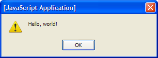

## The Beginning

One of my favorite languages will always be Java but not because of its abilities or characteristics. Being the first language I learned, Java has a special place in my heart. It was fairly easy to grasp and I was able to learn the ins and outs of the language in a very proficient timeline. When I first learned Computer Science, I did not think it was possible to find a language that would be as simple as Java. Although C and C++ felt more logical and intuitive, it was also more complicated. Lisp and PROLOG had their own strengths and weaknesses, but I didn’t see any practical use for it outside of the subject of Artificial Intelligence. However, one thing I enjoyed about using Lisp was how easy it was to manipulate lists and arrays. At that point, I realized that there are programming languages out there that could make my life a whole lot simpler.

I’ve heard about Python and other new hip languages out there that everyone is trying to learn. Everyone says it is great, but I never really understood what they meant. How much simpler can a language get from Java? Little did I know, Java had an evolution that had everything great about it but much more.

Javascript felt like a dream to me at first. To start off, creating functions was a breeze. This was mainly due to the fact that Javascript does not require a defined return type when creating the function. This allows tremendous flexibility that I have not felt in a while. To elaborate, this meant that the user can input a string and return an integer, or input any type of variable and return anything else. I feel that this would be very useful in catching user error, as the system won’t crash if the user inputs something that isn’t valid. It also allows one function to be used for any input or output type, which I find to be fabulous and very efficient.

Another feature that I fell in love with is the ability to create variables without defining the type. This allows further flexibility when manipulating variables, so switching from strings to integers is a breeze. Less variables are initialized because of this feature, which saves time and decreases the number of variables that the programmer must keep track of. Furthermore, it will reduce the memory used to hold these variables.

Finally, my favorite feature of Javascript is the ability to create an array with all sorts of variable types there. When working with Lisp, I thought that being able to create lists with any variable types was an awesome feature. To see something similar in Javascript was a dream come true for me. Working with C, C++, and Java showed me how complicated manipulating arrays could be. Javascript allows such an easy way to create and manipulate arrays, which makes me very excited to see what I can accomplish with this language.

In conclusion, Javascript has been very pleasant to use so far. It offered create things I liked from Java such as object oriented programming, but made it a lot easier. Learning Javascript makes me eager to expand my knowledge on other languages so that I can be exposed to how efficient things could be. 

## Getting Better

Learning the basics of Javascript was very easy to learn and follow. The concepts were similar to Java and C, but much easier. However, I do believe that the mastery level of Javascript is also very high due to its functionality, making it a very vast language with an incredible potential that I'd love to explore. 

One of the ways I am being trained to think in Javascript is through an athletic software engineering method called "Workout of the Day," or WOD's. A WOD is a timed exercise where I have to create a code that can solve a certain problem in a short manner of time. So far, I have done 1 WOD and I did it in a very good time.

This form of practice helps me a lot. I feel that because this is a timed exercise, I know that I will not have much time to think about the problem, which means that I must be at a level where I can evaluate a problem quickly and be able to come up with a solution very fast. This forces me to ensure that I come to every WOD confident in my abilities, and the only way to achieve that is through practice. 

The most nerve wracking part of taking a WOD is sitting in the room before the question is given. I wonder if all the practice WOD's I have been doing will be easier or harder than the one that will be given to me soon. I wonder what will happen when I get the problem and I have no idea what to do, although the answer may be obvious. I fear that I may make a silly syntax error, and completely fail the WOD. However, once I receive the WOD, I tend to think "this isn't so bad" and I start typing away to victory. 

