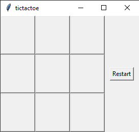
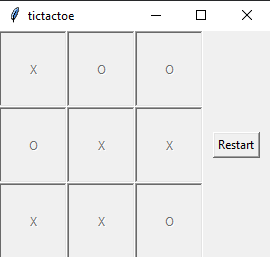
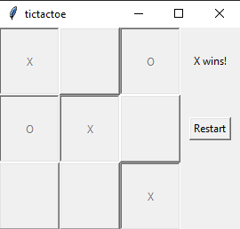

## Background

During block 2 of Undergraduate Cyber Training for the USAF, I learned how to code in Python for the first time. While I had background experience in other coding languages, I was astonished to learn how easy it was to manipulate data in Python compared to other languages such as C or Java. Therefore, I decided to take more time to learn the language at a deeper level and started my project of building a Tic Tac Toe application.

## The Process

The first part was learning how to create and manipulate a GUI. I learned that Python has a library called tkinter for GUI's, so I took a few hours to learn how to use this tool. Starting from creating windows, labels, and buttons, I fiddled around with the library until I was able to make a 3x3 pattern on a grid.

Next I had to program the buttons so that when it was clicked, it did 3 things:
1. The button will be disabled and unclickable.
2. The button will display either an X or and O depending on whose turn it is.
3. The button game will run through the win conditions to see if the game is over (more on this later).

This was probably the hardest part about this project. The logic behind these 3 rules weren't hard to implement, but the manipulations of data with objects and functions was something I had to study for a few hours until I could get it to work. In the end, I was incredibly satisfied with being able to click the buttons and produce an output that I wanted.

At this state, if two humans who knew the rules of the game played with my application, they would have no trouble. They can know and decide when the game was ended, and press the restart button for continuous enjoyment. However, I felt that this application wouldn't be complete without the computer knowing that the game was over at a certain point, congratulating the winner, and putting an official end to the game. To do this, I needed to create win conditions for the program to check whenever there was a button input. This included conditions for all rows, columns, and diagonal lines throughout the grid. Once one of the conditions were met, I programmed the application to disable all remaining buttons and display who won the game, forcing the players to press the restart button to continue if they wanted to play another round.

## In Conclusion

This program took about 7-8 hours to accomplish. Half of this time was used to study and get to know Python in a deeper level than was taught in UCT. Although elementary, this project taught me how powerful Python is in data manipulation and object oriented programming. It takes the best parts of Java and the strength's of C, and combines them into an incredibly intuitive language.

Find the source code [here](https://github.com/yjkim97/tictactoe).
