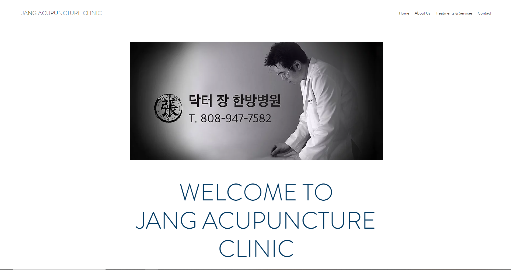
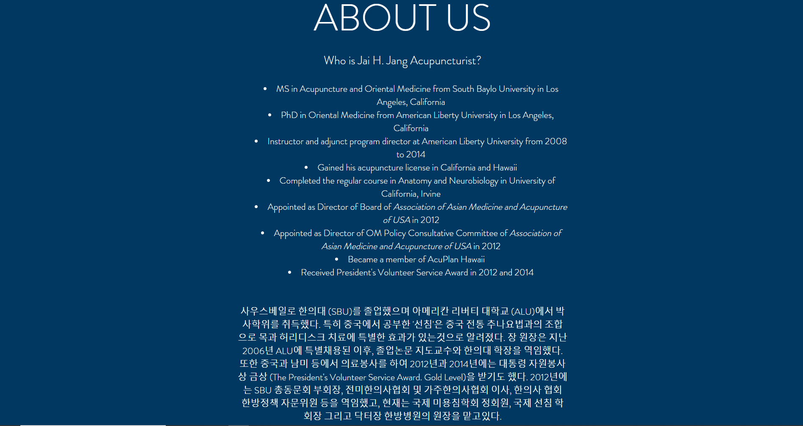
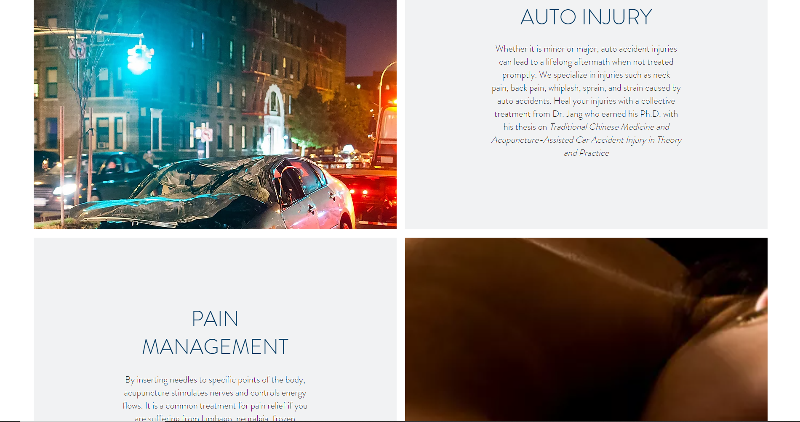

I developed a website for Jang Acupuncture Clinic. While the company already had a website, they asked me to develop a completely new website and educate them on how to manage it.

Since most customers of the company were those involved in accidents, I wanted to provide a professional yet calming webpage that would invite viewers to contact the doctor.

While there isn't much to say about this introductory website, there was a lot of lessons learned during the process. The main reason why this website was developed was because the company had a hard time reaching the creator of the previous website every time there had to be change. This process involved professional communication with the previous owner of the website, politely asking them to transfer ownership of the domain since their position was relieved. While communication was rough at first (the previous owner had some complaints about a not-so-experienced developer taking over), with the pressure of the company I was able to transfer the ownership to me, and then eventually to the company. Finally, I instructed the employees on how to update and revise the website as needed so that they would never run into the same issue again.

View the full website [here](https://www.drjhawaii.com/).
