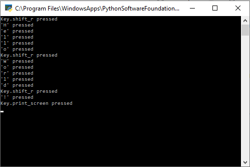
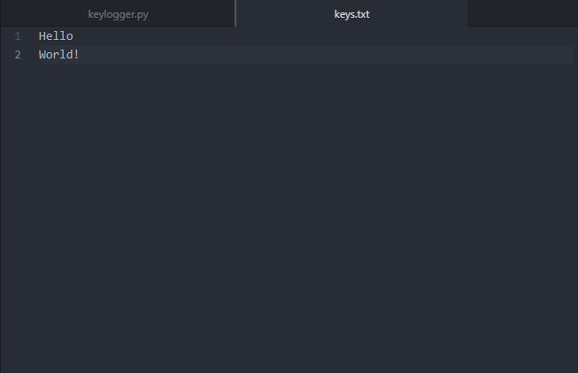
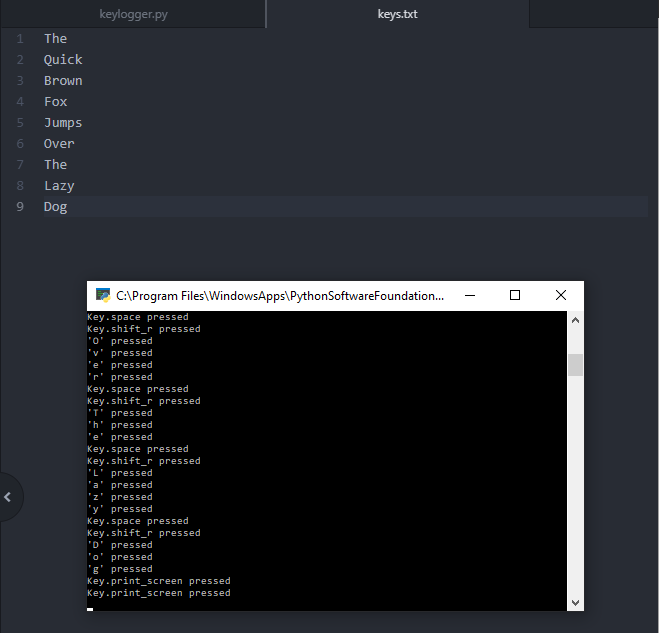

## What's a keylogger?
A keylogger is a malware designed to save the key strokes of whoever is utilizing the computer. This is practical when it comes to figuring out classified messages and passwords. If a keylogger (or multiple keyloggers) were to be deployed on a company computer, the employee using it can easily expose sensitive information to an unwanted party.

## Why a keylogger?
After creating my Tic Tac Toe application, I decided to write a piece of code that was more practical in the real world. As a Cyber Operations Officer, it's important to know how malware works on the most basic level. Understanding these concepts allows defenders to understand how easy it is to perform certain attacks.

## How a keylogger? (Doesn't make sense but please go with it)

The keylogger was made utilizing the library pynput. This library must be downloaded externally, so it is important to download this library for this code to work. For practical purposes, this library can be included with the payload when the keylogger is installed. By keeping track of each keystroke, the keylogger writes each input into a .txt file called key.txt. The code is written so that the keystrokes are appended onto the file, so the initial creation of the file must have happened before this program is executed. This means that you will also need to add in a file called keys.txt if you want a practical execution of this keylogger. Once this file writes the keystrokes into the file, it replaces all quotations with blank characters. This prevents the file from looking something like 'h''e''l''l''o'' ''w''o''r''l''d'. Next, each space character was replaced with a new line character for a cleaner look in the text file.
Here is what it looks like compared to the keystrokes.

## Where a keylogger? (Starting to sound like Drax from Guardians of the Galaxy)
Keyloggers are incredibly malicious when it is executed on an environment with relaxed security standards. For example, if a company allows their employees to use social media on their work computers, the keylogger can find password information for their accounts, leading to other attacks such as social engineering. Furthermore, a keylogger planted on the right computer can expose the administrator password for an entire network. This allows attackers to lock down networks, execute ransomware, and change permission settings to further escalate privileges'. 

## Disclaimer
This code is made for educational purposes and was a project to understand how easy it was to create a simple, yet effective, malware. Do not use malware for illegal purposes.
You can find the source code [here](https://github.com/yjkim97/pythongkeylogger).
