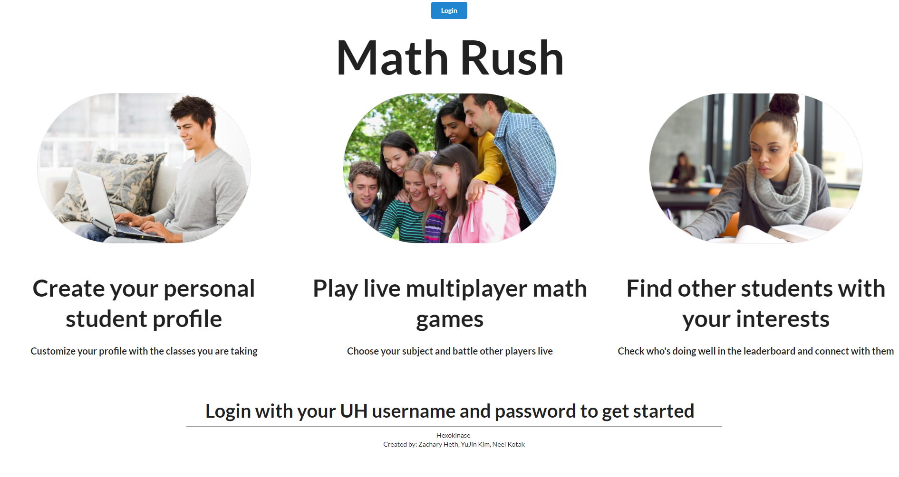
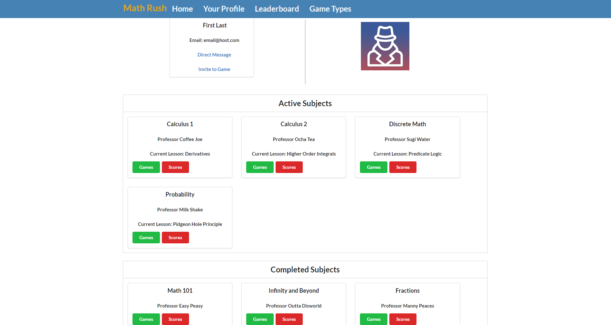
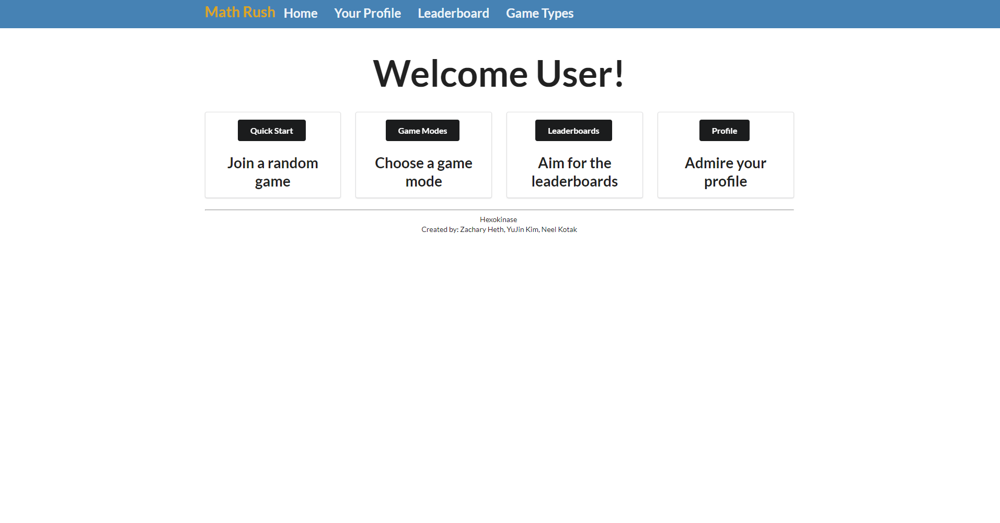

Math-Rush is an application made for UH Manoa students who are looking to find alternative ways to study math. Math Rush provides users a way to find subjects based on what they are learning and play several different games. 

This application allows students to log in with your UH credentials. By doing so, they can keep track of their completed subjects in math and what they want to work on. Teachers can also upload their course subjects and problems they want their students to learn.

This was a team based project that took approximately 2 months. Although it is still in its early stages, there is a lot of vision on what we want this project to look like in the future. Functionalities such as being able to connect with other students for study sessions, multiplayer math games, and student-teacher connections are just a few things of what Math Rush will consist of. 

View the github.io page [here](https://hexokinase.github.io/).
Or view the source code [here](https://github.com/hexokinase/math-rush).
