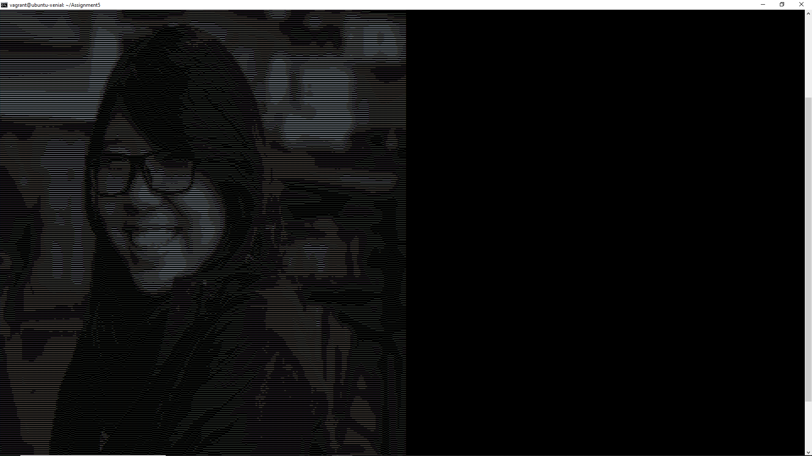
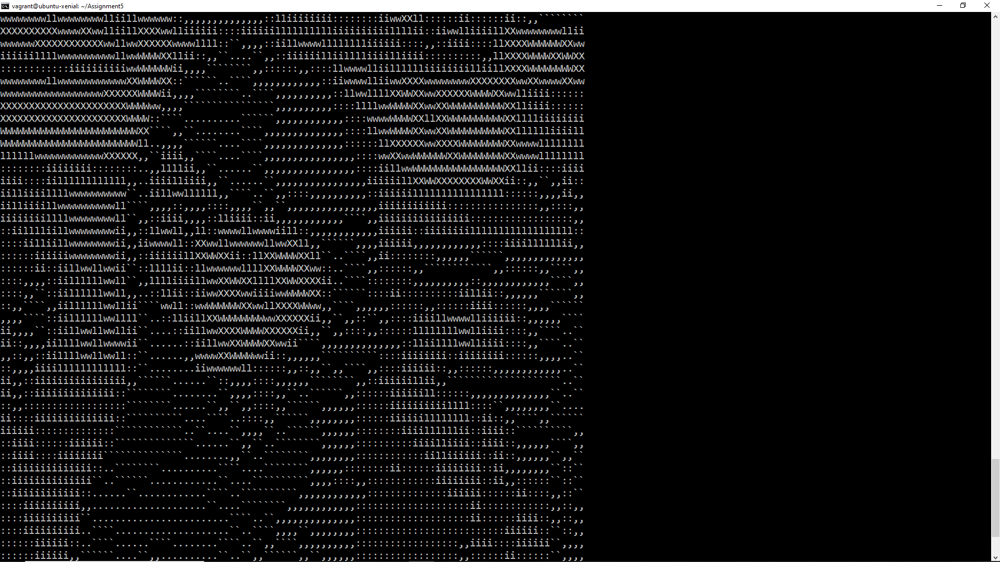

ASCII Art Creator turns any .png file into a beautiful ASCII art.

This application analyzes the RGB patterns of a picture. After turning the colors into numerics based on their brightness, this application then turns each value into a given ascii character. Numbers representing darker colors will be translated to "filling" characters such as 'X'. Pixels with lighter colors are translated to smaller characters such as ','.

The user can also specify the width of the ASCII art. Lower character counts will fill up less of the screen. This decreases the quality of the picture. The following picture was created with 50 characters as the width, while the previous picture was at 200 characters.

Here is the actual image of Kara, my model.

Definitely one of my most rewarding projects. While a program like this may not have any practical application in the real world, it allowed me to get a more in-depth experience with Assembly. Since this application utilizes several different programs, it was crucial that each component of this project worked perfectly. For example, my code to translate the color pixels to values had to perform properly so that I could pipe those outputs to my ASCII art creator.

View the github.io page [here](https://hexokinase.github.io/).
Or view the source code [here](https://github.com/hexokinase/math-rush).
