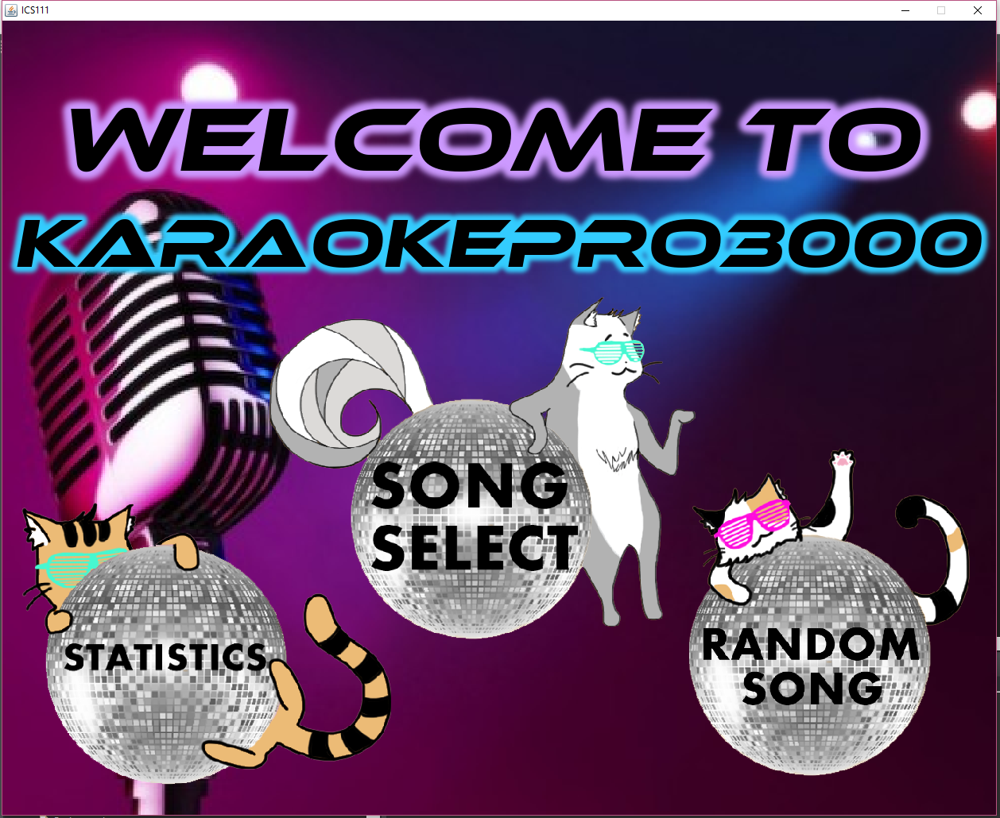
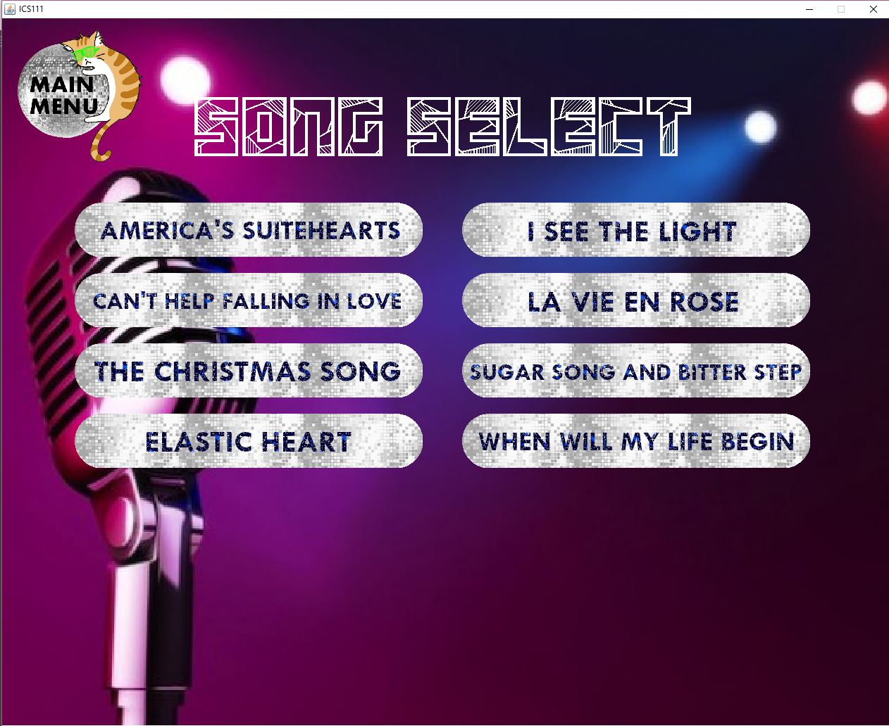
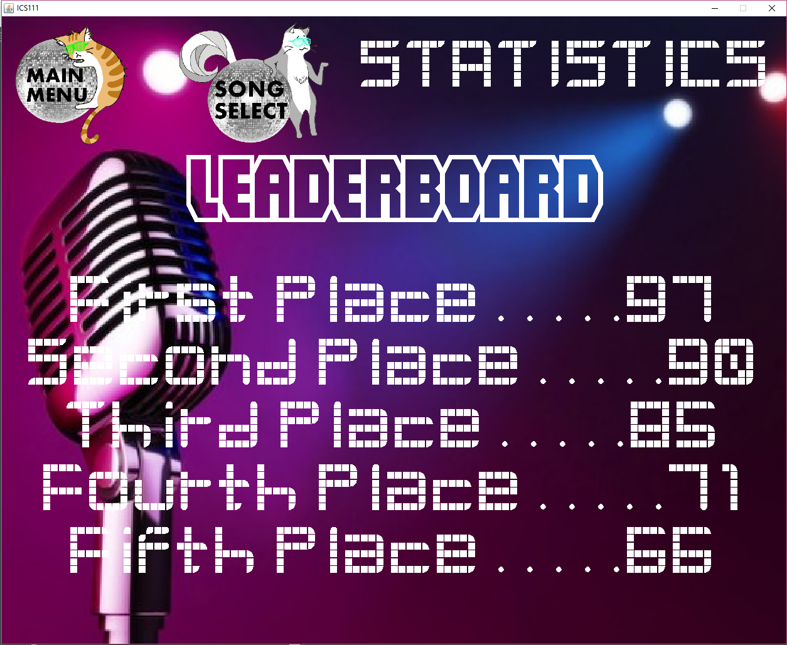

  
  
  

KaraokePro3000 is a program created by myself and three other members of my ICS 111 class. We used Java as the language and utilitzed a class file called EZ.java. EZ.java is a file that was made and distributed by a graduate student from the University of Hawaii, which allowed a very easy access to manipulating images. By utilitizing this class, we were able to make a karaoke machine that could play a certain amount of songs in the data base, print out a score, and keep track of previous scores. After each run through of a song, a random number would be printed out with a comment on the score. We decided to print a random number, mainly because we felt that karaoke machines did not really evaluate a persons singing. 

For this project, I helped design the main menu of the program. For having no programming experience except for the semester I had of ICS 11, it was a challenge. The menu had to be able to navigate through different pages that allowed the user to run the program. Not only that, I also added music and animation to the title screen. Finally, each of us were in charge of adding two songs to our database. Each song had to have the lyrics printed on the screen, and had to be timed perfectly so that the user had enough time to read off of it. At some points, songs would have pauses where there would be no lyrics, so we would have to account for that. 

Overall, this program was a success. If this project was worked on a bigger scale, we would be able to add a lot more songs, which would allow it to be more useful for a wider variety of users. 
